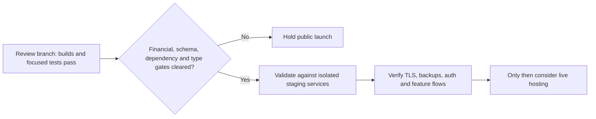

# Quatava4 — deployment readiness review (2026-09-30)

**Decision: do not launch this branch to a public host yet.** The backend compiles, the frontend production bundle builds, and the focused backend tests pass, but critical payment-state, database-upgrade, dependency-security, and type-checking risks remain. This review did not deploy the application or contact its production database, payment providers, or public website; route compilation and code inspection are not a substitute for isolated staging tests of every feature.

## Verification results

- **Frozen dependency install:** passed with pnpm 10.15.0 using `pnpm install --frozen-lockfile --ignore-scripts`.
- **Backend build:** passed with `pnpm --filter backend build` after the auth and PostgreSQL TLS changes.
- **Backend unit tests:** 3 suites and 11 tests passed. Jest still reports that it force-exits because asynchronous handles remain open; investigate test cleanup.
- **Frontend lint:** passed with 0 errors and 15 warnings.
- **Frontend production build:** exited successfully with Next.js 16.3.3 and emitted its route inventory. It also reported a Webpack “Critical dependency: the request of a dependency is an expression” warning from `ox`/`viem` pulled through the wallet integration. More importantly, `frontend/next.config.js` sets `typescript.ignoreBuildErrors: true`, and the build explicitly skipped type validation.
- **Standalone frontend type-check:** did not complete. `tsc --noEmit` exhausted the default heap and also failed with an 8 GB heap after roughly six minutes; it produced no actionable compiler diagnostics before the out-of-memory abort. The frontend tree contains more than 2,600 TypeScript/JavaScript source files.
- **Production dependency audit:** `pnpm audit --prod` improved from **4 critical, 135 high, 139 moderate and 18 low** findings to **0 critical, 90 high, 81 moderate and 14 low**. Remaining high-severity packages include `ip`, `xlsx`, `nodemailer`, `ws`, `undici`, `form-data` and `postcss`; the audit still exits non-zero because findings remain.
- **Safe deployment-check behavior:** `scripts/check-deployment.mjs` now requires an explicit `SITE_URL`; running it without one exits with code 2 and makes no network request. Its old NFT-demo-marker readiness test is still stale and should be replaced with actual staging health checks.
- `git diff --check`, backend JavaScript syntax checks, shell syntax checks, and the no-URL deployment-check test passed. No real database connection or external provider flow was exercised.

## Why it is not ready for live users

**The dLocal webhook can lose or misapply wallet balance changes.** In `backend/src/api/finance/deposit/fiat/dlocal/webhook.post.ts`, the handler updates the transaction status before applying the wallet credit/debit. If the wallet write fails after a `PAID`, refund, or chargeback status is saved, a provider retry can see the new status and skip the balance adjustment. The state change and wallet mutation are not protected by one database transaction or an append-only idempotent ledger, so concurrent duplicate notifications can also race. For `PARTIALLY_REFUNDED`, the code sets `refundAmount` to the entire original `transaction.amount` and subtracts that full amount; it does not reconcile a partial refund amount. Do not enable real dLocal deposit/refund/chargeback flows until this path is redesigned and tested against provider sandbox notifications, including retries, concurrent delivery, partial amounts, and currency/amount validation.

**The schema lifecycle is not safe enough for routine production upgrades.** `backend/src/db.ts` calls `sequelize.sync()` during startup, while the repository contains only two files under `backend/migrations` for 141 initialized Sequelize models. The deployment guide now warns that this is not a versioned migration/rollback process. Before a live launch, establish reviewed, versioned migrations and test both a fresh database and an upgrade from a production-like snapshot; do not use a production seed as a schema migration.

**The dependency audit still has substantial high-severity exposure.** The targeted package updates removed all four critical findings and reduced high findings from 135 to 90, but the remaining packages need triage and resolution before public financial use. Replace or isolate vulnerable packages such as `xlsx` and `ip`, update the mail stack safely, and rerun the production audit. The install also reported wallet peer-version mismatches (including the Reown/Wagmi integration and Zod peers); resolve these with wallet-connect and signing-flow tests rather than forcing an untested major-version alignment.

**Frontend type correctness is unknown.** The successful build does not establish type safety because type failures are explicitly ignored. Reduce the TypeScript program size or split checks into manageable projects, get `tsc --noEmit` to complete reliably, then remove `ignoreBuildErrors: true` and require type validation in the production build/CI gate.

**Some real-time market feeds are placeholders or approximations.** The futures market WebSocket handler sends `data: []` for its `trades` stream. The ecosystem `trades` stream derives trade-like entries from one-minute candles rather than actual fills. Binary, ecosystem and futures order WebSocket handlers do exist in the current source, so older audit claims that those handlers were absent are stale; the order handlers poll roughly every five seconds, which also means updates are not instantaneous. These product behaviors should be made explicit or completed before advertising live market data.

The repository's older `QUATAVA4_AUDIT_REPORT.md` is not a reliable current feature inventory. The current tree has NFT API routes and the order WebSocket handlers noted above, and the dLocal webhook contains refund/chargeback branches; those branches still have the correctness risks described here. The deployment checker also still tests old NFT demo markers, so a successful marker match would not be a sound general readiness signal.

## Changes made on this branch

- Added production startup validation for four distinct JWT/token secrets, each at least 64 characters, and removed the sample secret values from `.env.example`.
- Changed PostgreSQL TLS to validate server certificates by default. The setting is exposed as `DB_SSL_REJECT_UNAUTHORIZED`; keep it true in production and install the correct CA rather than disabling validation.
- Removed the reusable production super-admin password. Production seeding now requires a unique `APP_SUPER_ADMIN_PASSWORD`; seeder SQL is PostgreSQL-compatible and parameterized. The blog demo account also no longer receives a fixed shared password.
- Changed admin-created users to receive a random initial password instead of `12345678`.
- Pinned pnpm 10.15.0, synchronized the lockfile, switched documented installs to frozen-lockfile mode, and aligned the frontend TypeScript declaration with the root override and actual TypeScript 5.9.x resolution.
- Updated vulnerable Next.js, PostCSS, Sharp and WebSocket packages; added narrow transitive security overrides and removed the unused Swiper dependency. These changes reduced—but did not eliminate—production audit findings.
- Replaced the removed Next.js `next lint` command with ESLint, made the root lint script non-mutating, imported the missing NFT `Separator`, fixed the referral clipboard success/error flow, and removed an empty binary-store branch.
- Updated PostgreSQL/HTTPS deployment guidance, hardened the bootstrap script, and made the deployment checker refuse to target a public host implicitly.

## Recommended hosting sequence

1. **Hold live launch** while the dLocal balance mutations, migration strategy, remaining high-severity advisories, and frontend type-check gate are unresolved.
2. Prepare an isolated staging environment with PostgreSQL, TLS and certificate verification enabled. Apply versioned migrations there, verify backups and restore, and seed only that disposable database.
3. Configure the host-side secrets from `.env.example`: four independent token secrets, `DATABASE_URL`, mail settings, and every payment, blockchain, storage and OAuth credential for features you actually enable. Keep all server secrets out of `NEXT_PUBLIC_*` values.
4. Choose one documented hosting path (the VPS/PM2/Nginx guide or the Firebase App Hosting configuration), pin Node 22 and pnpm 10.15.0, install with a frozen lockfile, and require the frontend type-check and production build to pass in CI.
5. On staging, verify HTTPS cookies, account creation/login, admin bootstrap, deposits and failed/refunded/partial-refund/chargeback retries, wallet accounting, withdrawals, order placement/settlement, and the market streams. Use `SITE_URL` only with the explicit staging origin after replacing the old demo-marker check with health checks that reflect the deployed app.
6. Only after these gates pass should you select a host, configure production DNS/TLS, backups, monitoring and log rotation, and separately authorize a live deployment.

**No deployment or production change was made during this review.**